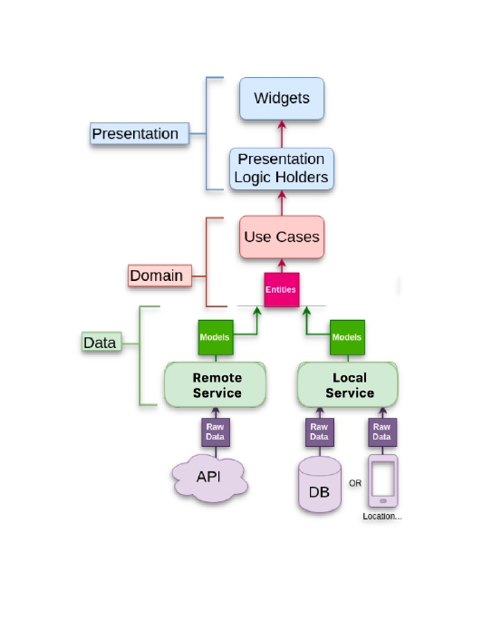

# Challenge FUDO
## Prueba tecnica Flutter developer

Proyecto realizado para el challenge de FUDO, en este proyecto utilicé el gestor de estados de Riverpod, agregando también testing de service y de widgets. 💻

## Características
El proyecto se compone principalmente por tres features principales
- Post
- Auth
- User

## Arquitectura
Arquitectura utilizada en el app:



## Instalación
Para la instalacion del proyecto debemos tener en cuenta las versiones de [Flutter](https://flutter.dev/).

Clonar el repositorio:

```sh
git clone https://github.com/Sebastian-Beltran/prueba-fudo.git
```

Navegar al directorio del proyecto:

```sh
cd prueba-fudo
```
Instalar dependencias:

```sh
flutter pub get
```

Para correr el proyecto se debe correr el siguiente comando:

```sh
flutter run
```
## Testing
El proyecto cuenta con testing de service y de widgets para poder correr los test primero debemos generar los mock con el siguiente comando:
```sh
dart run build_runner build —delete-conflicting-outputs
```
Luego para ver el resultado de los test podemos correr el siguiente comando:
```sh
flutter test
```
## Tecnologías Usadas
- [Flutter](https://flutter.dev/) - Framework de desarrollo.
- [Dart](https://dart.dev/) - Lenguaje de programación.
- [Riverpod](https://pub.dev/packages/flutter_riverpod) - Gestor de estados.

## Autor
- **Sebastian Beltran Gonzalez** - [GitHub](https://github.com/Sebastian-Beltran)
